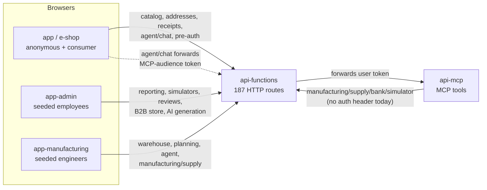
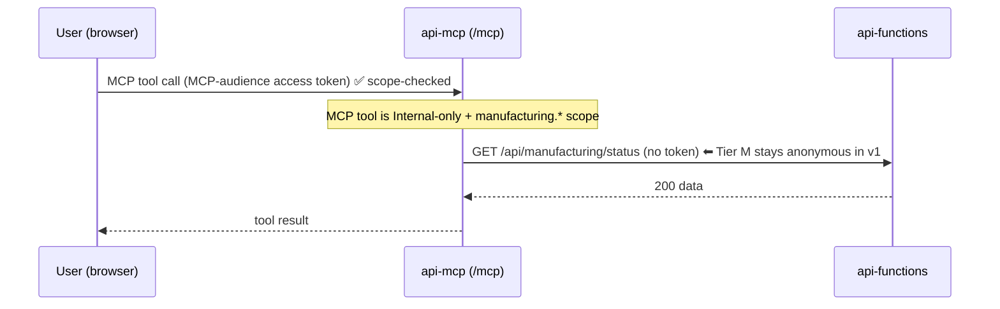

# Functions API OAuth Authorization

> Extends the self-contained AdventureWorks OAuth demo — already protecting the **MCP**
> server ([`docs/features/mcp-oauth`](../mcp-oauth/README.md)) and the **DAB** GraphQL/REST
> API (JWT config in [`api/dab-config.json`](../../../api/dab-config.json), see
> [`api/README.md`](../../../api/README.md)) — to the previously-anonymous
> **`api-functions`** HTTP surface.
>
> **Status: Phases A–D + F implemented; Phase G (tests + docs) landed; Phase E deferred with
> Tier M.** The `api-functions` resource server validates api-mcp-issued bearer tokens, enforces
> per-route scope + user-category, and applies Tier-C consumer record ownership. It ships in a
> **non-breaking default posture**: enforcement mode defaults to **`audit`** (validate-if-present,
> never block) so the deployed demo keeps working while partial client rollout continues. Flip to
> `enforced` only once every first-party client attaches tokens (see
> [Enforcement modes](#enforcement-modes) and [Accepted v1 limitations](#accepted-v1-limitations)).

## Contents

- [What this covers](#what-this-covers)
- [Current state](#current-state)
- [Relationship to the MCP and DAB OAuth work](#relationship-to-the-mcp-and-dab-oauth-work)
- [Caller topology (who calls api-functions)](#caller-topology-who-calls-api-functions)
- [Authorization tiers](#authorization-tiers)
- [Tier M — the v1 descope](#tier-m--the-v1-descope)
- [Two design problems and their resolutions](#two-design-problems-and-their-resolutions)
- [Scopes and roles](#scopes-and-roles)
- [Ownership / record-level authorization](#ownership--record-level-authorization)
- [Resource identifier / audience design](#resource-identifier--audience-design)
- [Route-to-scope matrix](#route-to-scope-matrix)
- [Enforcement modes](#enforcement-modes)
- [Implementation roadmap](#implementation-roadmap)
- [Accepted v1 limitations](#accepted-v1-limitations)
- [Source map](#source-map)

## What this covers

`api-functions` is the .NET-isolated Azure Functions app (running in Container Apps) that
provides custom business logic for the e-shop, admin, and manufacturing frontends, plus AI
agent hosting and simulators. Every one of its **187 HTTP-triggered routes is currently
`AuthorizationLevel.Anonymous`**. This phase decides — for each route — whether it should stay
anonymous or become an OAuth-protected resource, and with which scope and access mode, reusing
the exact same authorization server, scope catalog, and validation approach already shipped for
MCP and DAB.

Non-HTTP triggers (53 queue, 7 SQL, 3 timer) are internal and not externally reachable, so they
are out of scope for bearer-token protection.

## Current state

| Trigger kind | Count | In scope for OAuth? |
| ------------ | ----- | ------------------- |
| HTTP (`HttpTrigger`) | 187 | **Yes** — classified in the matrix |
| Queue (`QueueTrigger`) | 53 | No — internal |
| SQL (`SqlTrigger`) | 7 | No — internal |
| Timer (`TimerTrigger`) | 3 | No — internal |

All 187 HTTP routes were `Anonymous` before this work. `Program.cs` uses
`ConfigureFunctionsWebApplication()` (ASP.NET Core integration), so a JWT-validation
**middleware** (`IFunctionsWorkerMiddleware`,
[`FunctionsAuthorizationMiddleware`](../../../api-functions/Auth/FunctionsAuthorizationMiddleware.cs))
is now the enforcement point — the same signature/issuer/audience/lifetime/subject/scope checks
used by the MCP and DAB resource servers, validating against the api-mcp JWKS. Enforcement is
gated by [mode](#enforcement-modes) and defaults to `audit`, so routes still behave anonymously
until a client presents a token.

## Relationship to the MCP and DAB OAuth work

The authorization server (OpenIddict, hosted in **api-mcp**) is already **multi-resource**
(RFC 8707): it mints short-lived, resource-bound JWTs for the MCP resource (`{issuer}/mcp`) and
the DAB resource (`{issuer}/dab`), signs them with a Key Vault-backed RSA key, and exposes JWKS.
Protecting Functions adds **one more resource identifier** (`{issuer}/functions`) to the same
server — `api-functions` becomes a pure **resource server** that validates tokens via the api-mcp
JWKS and needs **no Key Vault access of its own**. This keeps the least-privilege story clean and
reuses all existing building blocks.

## Caller topology (who calls api-functions)

Understanding every caller is what determines the tiers — especially which endpoints must stay
anonymous to avoid breaking existing behavior.

Two facts drive the design:

1. **`api-functions` → `api-mcp`.** The `agent/chat` endpoint already forwards the caller's
   **MCP-audience** token to the protected `/mcp` so agent tool calls run as the real user.
2. **`api-mcp` → `api-functions`.** Four proxy services (`ManufacturingService`,
   `SupplyChainService`, `BankService`, `SimulatorService`) call ~44 Functions endpoints
   **with no `Authorization` header**, backing the manufacturing/supply/bank/simulator MCP tools.

## Authorization tiers

Every route is assigned exactly one tier (full list in
[`ROUTE_SCOPE_MATRIX.md`](./ROUTE_SCOPE_MATRIX.md)):

| Tier | Name | Meaning | Count |
| ---- | ---- | ------- | ----- |
| **P** | Anonymous | No token. Public catalog, discovery, health, pre-auth (login/reset), AI-assistant pass-through. | 18 |
| **C** | Consumer (ownership) | Valid token + business scope; consumers restricted to their **own** records (server-resolved owner id), internal roles unrestricted. | 9 |
| **I** | Internal-only | Valid token + business scope + **non-consumer category** (defense-in-depth). | 116 |
| **M** | Anonymous — v1 descope | Reachable via an api-mcp proxy tool; stays anonymous in v1 (see below). | 44 |
| | | **Total** | **187** |

## Tier M — the v1 descope

The ~44 endpoints the four proxy services call would normally be **Internal-only**
(manufacturing/supply/bank/financials data). But protecting them would break the MCP tools that
call them, because:

- those outbound proxy calls carry **no** `Authorization` header, and
- the authorization server currently supports **only** `authorization_code` + PKCE — there is no
  `client_credentials` or token-exchange grant, so **api-mcp cannot obtain a Functions-audience
  token on its own behalf.**

**Decision (per request): descope Tier M in v1 — leave exactly those proxied (method, route)
pairs anonymous, documented — and protect everything else.** These endpoints remain protected
*at the MCP layer* (the tools that reach them are `Internal-only` and require
`manufacturing.*` / `sales.read` / `admin.write` / `mcp.admin`). The direct HTTP endpoints are
still anonymous, which is an **accepted, documented limitation** — and it does include some
mutating endpoints (`manufacturing/begin`, `manufacturing/stop`, `supply/order`,
`bank/deposit`, `bank/withdraw`, config `PUT`s, `simulators/reset`).

**Forward path (a later phase):** make api-mcp a **confidential client** (its first secret, stored
in the existing RBAC Key Vault, read via managed identity) and add a non-interactive grant —
preferably **RFC 8693 token exchange** (exchange the caller's MCP token for a down-scoped,
identity-preserving Functions token) or, as a simpler fallback, **client credentials** with a
`functions.service` scope. The proxy `HttpClient`s then attach a Functions token per call, and the
Tier M rows graduate to Tier I.

The split is **method-accurate**: e.g. `POST /api/manufacturing/proposals` is Tier M (the
`propose_*` tools POST to it) while `GET /api/manufacturing/proposals` is Tier I; likewise
`GET /api/manufacturing/workforce` is Tier M but `.../workforce/detail` is Tier I.

## Two design problems and their resolutions

1. **`agent/chat` audience conflict.** If `agent/chat` validated a *Functions* audience, it could
   not also forward an *MCP* audience token to `/mcp` (a token targets exactly one resource; the AS
   returns `invalid_target` for multiple). **Resolution:** keep the agent-host endpoints
   (`agent/chat`, `agent/status`) **anonymous pass-throughs** (Tier P). The anonymous e-shop
   assistant is preserved, and MCP tool authorization is still enforced downstream at `/mcp`.
2. **`api-mcp` → `api-functions` M2M.** Resolved for v1 by the Tier M descope above.

## Scopes and roles

Reuses the shared business-domain catalog in
[`OAuthScopes.cs`](../../../api-mcp/AdventureWorks/Auth/OAuthScopes.cs). Distribution across the
protected (Tier C/I) routes:

| Scope | Routes | New? |
| ----- | -----: | ---- |
| `admin.write` | 39 | existing |
| `sales.read` | 20 | existing |
| `admin.read` | 19 | existing |
| `manufacturing.read` | 15 | existing |
| `manufacturing.write` | 15 | existing |
| `orders.write` | 6 | existing |
| `orders.read` | 5 | existing |
| `customers.read` | 3 | existing |
| **`customers.write`** | 3 | **new — the only catalog addition** |

`customers.write` is required because consumers self-manage their **own addresses** (address data
is served **only** by `api-functions` — it is excluded from DAB because of the `geography`
`SpatialLocation` column). A later phase adds it to `OAuthScopes.cs`, grants it to the `consumer`
role (ownership-gated for own records) and to the internal roles that mutate customer data, and
advertises it in AS metadata. Scope assignments align with the sibling MCP matrix wherever a
parallel capability exists (e.g. customer generation → `admin.write`, financial summaries →
`sales.read`, procurement/manufacturing financials → `manufacturing.read`).

Roles resolve to scopes exactly as today
([`ApplicationRoles.cs`](../../../api-mcp/AdventureWorks/Auth/ApplicationRoles.cs) →
`Auth.RoleScope` seed data). No permissions are hard-coded by user name.

## Ownership / record-level authorization

Tier C routes require the scope **and** record ownership. Ownership is resolved **server-side**
from the validated token's subject/owner claims (`customer_id` / `business_entity_id`), never from
a client-supplied identifier. This directly closes a live gap: the address endpoints today accept a
client-supplied `businessEntityId(s)` query parameter — in a later phase that value is
validated/overwritten against the caller's resolved owner id so a client value can never widen
access. Internal roles (with the same scope) are unrestricted.

## Resource identifier / audience design

- New canonical resource identifier **`{issuer}/functions`** (env-overridable, e.g.
  `FUNCTIONS_RESOURCE_IDENTIFIER`), added to the AS `AllowedResources()` allow-list next to the MCP
  and DAB identifiers — mirroring exactly how DAB was added.
- Frontends request the Functions resource via the RFC 8707 `resource` parameter and receive a
  token with `aud = {issuer}/functions`. Because each token targets a single resource, the MCP,
  DAB, and Functions tokens are **audience-isolated** and are stored under separate keys — a token
  minted for one resource is rejected by the others.
- Issuer, resource URI, endpoints, and redirect URIs are derived from deployed configuration (the
  api-mcp FQDN); no Azure hostnames are hard-coded.

## Route-to-scope matrix

The complete, authoritative classification of all 187 routes is in
**[`ROUTE_SCOPE_MATRIX.md`](./ROUTE_SCOPE_MATRIX.md)** — grouped by functional area, with method,
route, tier, required scope, access mode, and ownership key for every endpoint. It is the source of
truth the resource server enforces. Completeness is guaranteed by a reflection test
(`FunctionAuthorizationRegistryTests`) that fails closed if any HTTP-triggered `[Function]` is not
classified in the registry — exactly as `McpAuthorizationExtensions` does for MCP tools.

## Enforcement modes

The resource server reads `FUNCTIONS_OAUTH_MODE`
([`FunctionsOAuthOptions`](../../../api-functions/Auth/FunctionsOAuthOptions.cs)). Enforcement is
only possible when the issuer, audience, and OIDC metadata address are all resolved from
configuration; otherwise the server **fails open** to `disabled` so local and not-yet-wired
deployments keep working unchanged.

| Mode | Token absent | Token present | Blocks? | Purpose |
| ---- | ------------ | ------------- | ------- | ------- |
| `disabled` | allowed | ignored | never | Pure pass-through — pre-OAuth behavior. The implicit fallback when issuer/audience/metadata are unset. |
| `audit` *(default)* | allowed | validated; allow/deny logged to App Insights | never | Non-breaking shadow mode. Consumers that attach a token still get Tier-C record ownership; unwired internal/anonymous calls are never 401'd. |
| `enforced` | protected routes → `401` | validated + scope/category/ownership enforced | yes | Full enforcement. Flip here only once every first-party client attaches tokens. |

Infrastructure wires the mode in [`infra/main.bicep`](../../../infra/main.bicep) and defaults it to
`audit`. Anonymous tiers (P and the v1-descoped M) are always allowed regardless of mode.

## Implementation roadmap

Phases A–D and F are implemented; Phase G (this doc + resource-server unit tests) has landed; Phase
E stays deferred with the Tier M descope.

- **Phase A — Classification (done):** this document + the 187-route matrix.
- **Phase B — Authorization server (done):** `functions` resource identifier + protected-resource
  metadata; `customers.write` scope and role grants; `FunctionsResourceTokenTests`. (Tier M's
  non-interactive grant is deferred with the descope.)
- **Phase C — Resource server in `api-functions` (done):** JWT-validation middleware
  ([`FunctionsAuthorizationMiddleware`](../../../api-functions/Auth/FunctionsAuthorizationMiddleware.cs))
  + a visible per-route policy registry
  ([`FunctionAuthorizationRegistry`](../../../api-functions/Auth/FunctionAuthorizationRegistry.cs),
  mirroring the MCP tool registry) + Tier-C ownership checks
  ([`AddressFunctions`](../../../api-functions/Functions/AddressFunctions.cs)); Tier P and Tier M stay
  anonymous via explicit classification; structured App Insights authz telemetry.
- **Phase D — Frontend (done for `app`):** a [`functionsAuth.ts`](../../../app/src/services/functionsAuth.ts)
  PKCE (S256) client that attaches a Functions-audience token **only when signed in**, cleared on
  logout/switch, sessionStorage only, with an opt-in "Connect to Functions API" affordance on the
  account page. **Deferred:** `app-admin` / `app-manufacturing` token attachment for internal
  endpoints (and the related `app-manufacturing` DAB-token gap) — required before `enforced`.
- **Phase E — (deferred with Tier M)** api-mcp confidential client + token-exchange to protect the
  proxied endpoints.
- **Phase F — Infrastructure/AZD (done):** inject `FUNCTIONS_JWT_ISSUER` / `FUNCTIONS_JWT_AUDIENCE` /
  `FUNCTIONS_OAUTH_MODE` into the Functions container from the deployed api-mcp FQDN (mirrors the DAB
  bicep wiring); no secrets in outputs; `azd up`/`azd down` stay automated; mode defaults to `audit`.
- **Phase G — Docs & tests (done):** fast offline unit tests
  ([`api-functions.Tests`](../../../api-functions.Tests/)) covering registry completeness/no-stale
  entries, enforcement-mode resolution, and token-claim projection; this document updated. Azure
  integration tests (live valid/invalid/expired/wrong-issuer/wrong-audience against a running host)
  remain a follow-up.

## Accepted v1 limitations

- **Tier M endpoints remain anonymous** (including some mutations), because api-mcp cannot yet mint
  a Functions token. Mitigated by MCP-layer scope enforcement; resolved by Phase E.
- **Pre-auth flows stay anonymous by necessity** — `password`, `password/verify`,
  `password/reset/*` are the authentication mechanism and cannot require a token.
- **`agent/chat` / `agent/status` stay anonymous** to preserve the anonymous assistant and MCP
  token forwarding; tool authorization is enforced at `/mcp`.
- **`openapi.json` / `swagger/ui` stay anonymous** and may describe internal routes — acceptable for
  a demo; the routes themselves are still protected.

## Source map

| Path | Role |
| ---- | ---- |
| [`ROUTE_SCOPE_MATRIX.md`](./ROUTE_SCOPE_MATRIX.md) | Complete route → tier/scope/mode/ownership matrix (all 187 routes) |
| [`api-mcp/AdventureWorks/Auth/OAuthScopes.cs`](../../../api-mcp/AdventureWorks/Auth/OAuthScopes.cs) | Shared business-domain scope catalog (reused) |
| [`api-mcp/AdventureWorks/Auth/ApplicationRoles.cs`](../../../api-mcp/AdventureWorks/Auth/ApplicationRoles.cs) | Role → scope mapping (reused) |
| [`api-mcp/AdventureWorks/Auth/AuthorizationServerOptions.cs`](../../../api-mcp/AdventureWorks/Auth/AuthorizationServerOptions.cs) | Resource identifiers / `AllowedResources()` (includes `functions`) |
| [`api-mcp/AdventureWorks/Services/{Manufacturing,SupplyChain,Bank,Simulator}Service.cs`](../../../api-mcp/AdventureWorks/Services/) | The four proxy services that define the Tier M set |
| [`api-functions/Auth/`](../../../api-functions/Auth/) | The resource server: policy registry, options, token validator, user model, and enforcement middleware |
| [`api-functions/Functions/AddressFunctions.cs`](../../../api-functions/Functions/AddressFunctions.cs) | Tier-C consumer record-ownership reference implementation |
| [`app/src/services/functionsAuth.ts`](../../../app/src/services/functionsAuth.ts) | E-shop Functions-audience PKCE (S256) client + `functionsFetch` |
| [`infra/modules/flex-api-functions.bicep`](../../../infra/modules/flex-api-functions.bicep) · [`infra/main.bicep`](../../../infra/main.bicep) | Injects issuer/audience/mode into the Functions container |
| [`api-functions.Tests/`](../../../api-functions.Tests/) | Offline resource-server unit tests (registry coverage, mode resolution, claim parsing) |
| [`docs/features/mcp-oauth/README.md`](../mcp-oauth/README.md) · [`api/README.md`](../../../api/README.md) | Sibling OAuth designs this extends (MCP + DAB) |
