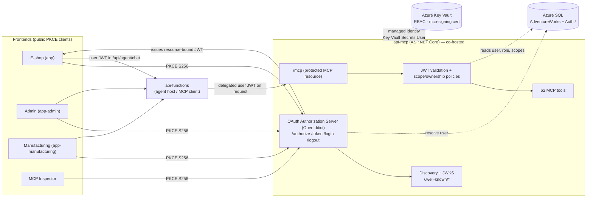
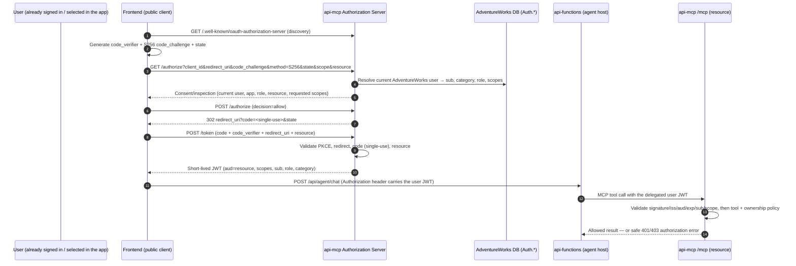
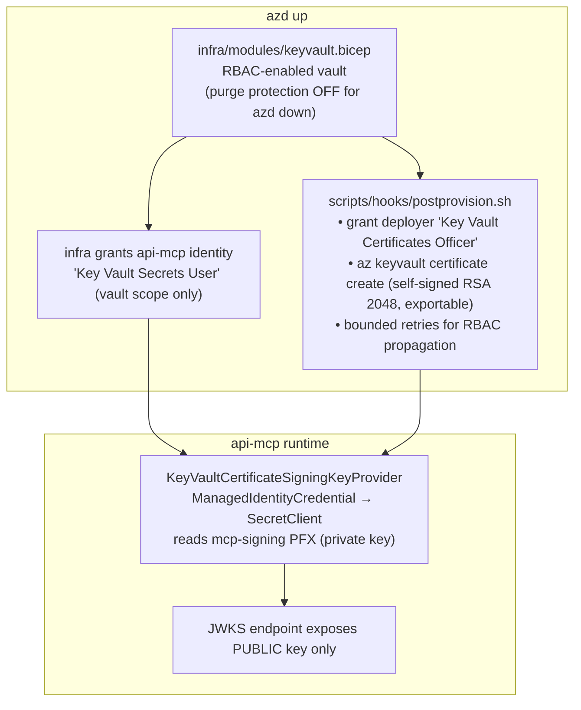

# MCP OAuth Authorization (Self-Contained Demo)

This feature turns the existing **`api-mcp`** service into an **OAuth 2.0-protected
MCP resource** *and* the **authorization server that protects it** — entirely
self-contained, provisioned automatically by `azd up`, and backed by the demo's
existing **AdventureWorks database users**.

> [!IMPORTANT]
> **This is a demonstration, not an enterprise identity system.** The seeded-user
> selection screens and the e-shop account-creation / password flows are the demo's
> *authentication* mechanism. The self-contained OAuth server **extends those existing
> AdventureWorks database-backed users** into OAuth subjects, scopes and policies. It is
> **not** Entra ID, it is **not** an external IdP, and it deliberately requires **no**
> manual app registrations, Keycloak, or post-deployment identity configuration. The
> `azd auth login → azd up → test → azd down` experience is fully preserved.

## Contents

- [What this demonstrates](#what-this-demonstrates)
- [Existing user model (preserved)](#existing-user-model-preserved)
- [Architecture](#architecture)
- [Subject design](#subject-design)
- [OAuth endpoints](#oauth-endpoints)
- [Clients](#clients)
- [Scopes and roles](#scopes-and-roles)
- [Tool-to-scope matrix](#tool-to-scope-matrix)
- [Ownership / record-level authorization](#ownership--record-level-authorization)
- [Authorization Code + PKCE sequence](#authorization-code--pkce-sequence)
- [JWT access-token validation](#jwt-access-token-validation)
- [Key Vault signing key (RBAC + managed identity)](#key-vault-signing-key-rbac--managed-identity)
- [Delegated token propagation and isolation](#delegated-token-propagation-and-isolation)
- [Demonstration steps (allowed and denied)](#demonstration-steps-allowed-and-denied)
- [Telemetry](#telemetry)
- [Testing](#testing)
- [Infrastructure and deployment](#infrastructure-and-deployment)
- [Security review](#security-review)
- [Accepted demo limitations](#accepted-demo-limitations)
- [Troubleshooting](#troubleshooting)

## What this demonstrates

- **OAuth discovery and authorization** served from `api-mcp` itself.
- **Authorization Code with PKCE `S256`** for browser / public clients (`plain` is
  rejected and is **not** advertised).
- **Resource/audience-bound JWT access tokens** (RFC 8707 `resource` indicator →
  `aud`).
- Full **signature, issuer, audience, lifetime, subject and scope** validation before
  any MCP processing.
- **Business-domain scopes** (not per-tool) with **tool-level and record-level
  (ownership)** authorization.
- **Delegated user context** propagated from the frontends through `api-functions` to
  `api-mcp`.
- **Allowed and denied MCP calls** determined by the *actual* AdventureWorks user, and
  a denied operation **succeeding after switching** to an appropriately authorized
  seeded user.
- **Signing material stored only in Azure Key Vault** (RBAC, not access policies), read
  by `api-mcp` via **managed identity** with **least privilege**.

## Existing user model (preserved)

The OAuth layer sits *on top of* each app's existing identity mechanism. Nothing about
login, user selection, account creation, anonymous browsing, or purchasing changes.

| App | Population | How the active user is established | OAuth behavior added |
| --- | ---------- | ---------------------------------- | -------------------- |
| **E-shop** (`app/`) | External consumers | Browse **anonymously**; **select/sign in** as an existing consumer; or **create an account** (password + reset preserved). | Anonymous browsing stays anonymous (public catalog only). Once a consumer is signed in, the app can obtain a **user-bound** token for catalog + **their own** carts/orders/profile. |
| **Admin** (`app-admin/`) | Internal employees | Selects an existing **seeded employee**. | Employee's **department → role → scopes** resolve to a user-bound token. Surfaces the **authorization-inspection** view (see [below](#authorization-inspection)). |
| **Manufacturing** (`app-manufacturing/`) | Manufacturing engineers | Selects an existing **seeded manufacturing user**. | Resolves to **manufacturing** scopes only — demonstrably **no** customer/admin/sales rights. |

There is **no** universal "persona selector" and **no** second user store. The
AdventureWorks database (`Person.Person`, `Sales.Customer`,
`HumanResources.EmployeeDepartmentHistory`, plus the new `Auth.*` catalog) is the single
authoritative source of users and authorization.

## Architecture



**Everything OAuth lives in `api-mcp`** — the authorization server, AdventureWorks user
integration, AS metadata, MCP protected-resource metadata, JWKS, JWT validation,
scope/ownership policies, and the existing `/mcp` endpoint. `api-functions` is **not** an
auth service; it only *forwards* the user's token. No second auth service was introduced.

The authorization server is built on **OpenIddict** (stable, standards-compliant). OAuth
codes, PKCE, replay prevention, token issuance, metadata, client/redirect validation,
scopes, resource indicators, signing credentials and lifetimes are all handled by the
framework — **no OAuth is hand-written and no tokens are hand-fabricated.**

## Subject design

A stable, unique **`sub`** is required across all user types and must not rely solely on
email or leak sensitive database keys.

- **`sub` = the lowercased `Person.rowguid`** (a random `uniqueidentifier` that already
  exists on every `Person` row). It is stable, globally unique across consumers and
  employees, and is *not* a sensitive business key (unlike `BusinessEntityID`,
  `CustomerID`, or `NationalIDNumber`).
- The resolved identity also carries **user category**, **role**, and **granted scopes**,
  plus an optional non-sensitive **display name**.
- The consumer **`CustomerID`** used for ownership checks is resolved **server-side** from
  the token subject (`Sales.Customer.PersonID`) — it is **never** taken from a
  client-supplied argument.

Access tokens contain **only** `iss`, `sub`, `aud`, `iat`, `exp`, the granted `scope`s,
user category, application context, role(s) and an optional display name. They **never**
contain passwords, hashes, reset tokens, payment data, addresses or unnecessary PII.

The resolution chain is deterministic and driven by seed data, never by user name:

```
AdventureWorks user ─▶ application role ─▶ OAuth scopes ─▶ MCP tool/ownership policies
    (Person / Customer / EmployeeDepartmentHistory)   (Auth.RoleScope)   (ToolAuthorizationRegistry)
```

## OAuth endpoints

All paths are relative to the deployed `api-mcp` base URL (the **issuer**), which is
derived from configuration (`MCP_PUBLIC_BASE_URL`) — **no Azure hostnames are
hard-coded**.

| Endpoint | Purpose |
| -------- | ------- |
| `GET /.well-known/oauth-authorization-server` | Authorization-server metadata (issuer, endpoints, JWKS URI, response/grant types, scopes, `code_challenge_methods_supported: ["S256"]`). Also served at `/.well-known/openid-configuration`. |
| `GET /.well-known/jwks` | JSON Web Key Set — **public** signing key only. |
| `GET /.well-known/oauth-protected-resource` | MCP protected-resource metadata (RFC 9728): the resource identifier and its authorization server(s). |
| `GET` / `POST /authorize` | Authorization endpoint. Requires PKCE `S256`, valid `state`, an **exact** registered redirect URI, known scopes, and (optionally) a `resource`. |
| `POST /token` | Token endpoint. Exchanges a single-use authorization code + PKCE verifier for a short-lived JWT. |
| `GET` / `POST /login` | Integrates the **current AdventureWorks user** into the authorization request (does not replace app login/selection). |
| `GET /logout` | Clears the authorization session/context. |
| `POST /mcp` | The **protected MCP resource**. Requires a valid `Bearer` token with `mcp.access`. Unauthenticated access returns `401` with a `WWW-Authenticate` challenge pointing at the protected-resource metadata. |
| Health / readiness | Remain **open** for Container Apps probes. |

## Clients

All first-party clients are **public** (no secret) and use **Authorization Code + PKCE**,
**explicit consent**, and `code` response type. Redirect URIs are wired from the deployed
app URLs at deploy time (`scripts/hooks/postdeploy.sh`) — never hard-coded.

| Client ID | App | Redirect URI (prod) | Local dev redirect |
| --------- | --- | ------------------- | ------------------ |
| `adventureworks-eshop` | E-shop | `<APP_URL>/oauth/callback` | `http://localhost:5173/oauth/callback` |
| `adventureworks-admin` | Admin | `<APP_ADMIN_URL>/oauth/callback` | `http://localhost:5174/oauth/callback` |
| `adventureworks-manufacturing` | Manufacturing | `<APP_MANUFACTURING_URL>/oauth/callback` | `http://localhost:5175/oauth/callback` |
| `mcp-inspector` | MCP Inspector | `<MCP_INSPECTOR_URL>/oauth/callback` | `http://localhost:6274/oauth/callback` |

No client secrets are committed. If a confidential credential were ever unavoidable it
would be stored in Key Vault and read via managed identity — but the demo uses public
PKCE clients exclusively, so none exist.

## Scopes and roles

**Business-domain scopes** (12), advertised in metadata and bound to the canonical MCP
resource so issued tokens carry the correct `aud`:

| Scope | Intent |
| ----- | ------ |
| `mcp.access` | Baseline — required for **any** authenticated MCP connectivity. |
| `products.read` | Public catalog: search, details, recommendations, reviews, promotions. |
| `sales.read` | Internal sales summaries / analytics / financial reporting. |
| `customers.read` | Internal customer lookup / enumeration (consumer self-access is ownership, not this scope). |
| `inventory.read` | Internal inventory levels and availability. |
| `orders.read` | Order history / status (consumers restricted to **their own** via ownership). |
| `orders.write` | Permitted order changes under current business rules. |
| `manufacturing.read` | Manufacturing plans, work orders, feasibility, simulations, production/supply-chain data. |
| `manufacturing.write` | Manufacturing / supply-chain mutations (runs, supply orders, configuration). |
| `admin.read` | Internal administration (read): promotion candidates, admin dashboards. |
| `admin.write` | Internal administration (write): data generation, bank operations. |
| `mcp.admin` | Security-sensitive / broad MCP administration (e.g. simulator reset). |

**Roles** are stored in `Auth.ApplicationRole`, mapped to scopes in `Auth.RoleScope`, and
assigned to employees by **current department** via `Auth.DepartmentRole` — **never by
user name**. Deterministic seed data mirrors the in-process fallback in
[`ApplicationRoles.DefaultRoleScopes`](../../../api-mcp/AdventureWorks/Auth/ApplicationRoles.cs).

| Role | Category | Granted scopes (besides `mcp.access`) |
| ---- | -------- | ------------------------------------- |
| `consumer` | consumer | `products.read`, `orders.read`, `orders.write` |
| `sales-admin` | employee | `products.read`, `sales.read`, `customers.read`, `orders.read`, `admin.read` |
| `marketing-admin` | employee | `products.read`, `sales.read`, `customers.read`, `admin.read`, `admin.write` |
| `inventory-admin` | employee | `products.read`, `inventory.read`, `manufacturing.read`, `admin.read` |
| `operations-admin` | employee | `products.read`, `sales.read`, `customers.read`, `orders.read`, `inventory.read`, `admin.read` |
| `executive-admin` | employee | **all 11** business scopes incl. `manufacturing.*` and `mcp.admin` |
| `manufacturing-engineer` | manufacturing | `products.read`, `inventory.read`, `manufacturing.read`, `manufacturing.write` |

**Department → role** seed (`Auth.DepartmentRole`, also the `SqlUserDirectory` fallback):

| Department | Role |
| ---------- | ---- |
| Sales (3) | `sales-admin` |
| Marketing (4) | `marketing-admin` |
| Purchasing (5), Shipping and Receiving (15) | `inventory-admin` |
| Production (7), Production Control (8) | `manufacturing-engineer` |
| Executive (16) | `executive-admin` |
| *any other employee department* | `operations-admin` (default) |

Note that `manufacturing-engineer` **excludes** `customers.read`, `sales.read`,
`orders.*` and `admin.*` — this is the **isolation** guarantee demonstrated by the
manufacturing app.

Anonymous e-shop users are **category `anonymous`** and are **never** issued an MCP access
token: they get public catalog browsing through the normal (unauthenticated) app paths
only.

## Tool-to-scope matrix

Every one of the **62** MCP tools is classified. The complete matrix — tool wire name,
required scope, access mode, and ownership argument — is in
**[TOOL_SCOPE_MATRIX.md](TOOL_SCOPE_MATRIX.md)**, generated from the single source of
truth [`ToolAuthorizationPolicy.cs`](../../../api-mcp/AdventureWorks/Auth/ToolAuthorizationPolicy.cs).
Startup validation **fails fast** if any discovered tool is unclassified, so coverage can
never regress.

## Ownership / record-level authorization

Scopes gate *domains*; **ownership** gates *records*. Tools that expose per-customer data
(`get_customer_orders`, `get_order_details`, `get_personalized_recommendations`) run in
`SelfOrInternal` mode:

- **Consumers** may act only on **their own** records. The `customerId` argument is
  validated / overwritten against the caller's **server-resolved** `CustomerID` (from the
  token `sub`). A client that supplies *another* customer's ID cannot widen access — the
  value is replaced, and mismatches are denied and logged.
- **Internal roles** holding the scope are unrestricted (e.g. a sales admin may look up
  any customer's orders).

`InternalOnly` tools additionally require a **non-consumer category**, so a consumer token
that somehow carried an internal scope would still be denied (defense-in-depth).

## Authorization inspection

Two surfaces expose *why* a request was allowed or denied, without ever revealing raw
tokens:

- **Consent / inspection page** — served **today** by the authorization server at
  `GET /authorize`. It shows the **current AdventureWorks user**, the **app** (client),
  the resolved **role**, the target **resource**, and the **requested scopes** before the
  user approves. It does **not** bypass the app's existing login/selection.
- **Admin authorization-inspection view** — the admin app's surface that additionally
  shows the **requested tool**, its **required scopes**, the **ownership result** and the
  final **allow/deny decision**. It is driven by the **server-side decision data** that
  `McpToolAuthorizationFilter` computes and logs for every tool call (subject, category,
  app, tool, required scope, ownership result, correlation ID, allow/deny category). Raw
  access tokens are **not** displayed by default.

## Authorization Code + PKCE sequence



Rejected at `/authorize` or `/token`: missing PKCE, `plain` PKCE, invalid/missing `state`,
wildcard or non-matching redirect URIs, unknown scopes/resources, and expired or reused
authorization codes; at `/token`, an invalid PKCE verifier is rejected.

## JWT access-token validation

Before **any** MCP processing, `api-mcp` (OpenIddict validation + the MCP authorization
filter) validates the token's:

1. **Signature** — against the Key Vault-backed public key published via JWKS.
2. **Issuer** (`iss`) — the deployed `api-mcp` issuer.
3. **Audience / resource** (`aud`) — the canonical MCP resource identifier.
4. **Lifetime** (`iat`/`exp`) — tokens live ~**10 minutes**; codes ~5 minutes.
5. **Subject** (`sub`) — present and resolvable.
6. **Scopes** — `mcp.access` for connectivity, plus the tool's required scope; then the
   tool access mode (public / ownership / internal-only).

Access tokens are **JWS** (encryption disabled) so the resource server can validate them
via JWKS.

## Key Vault signing key (RBAC + managed identity)



- The vault uses **Azure RBAC** (`enableRbacAuthorization: true`), **not** legacy access
  policies.
- The signing **certificate is created at deploy time** (`postprovision` hook); the
  **private key never leaves Key Vault**, is never committed, never baked into an image,
  and never placed in app settings or Bicep outputs.
- `api-mcp` reads the PFX using its **managed identity** with the **narrowest** role —
  **`Key Vault Secrets User`**, scoped to the **vault** (not the subscription). Runtime
  identities are **never** Key Vault Administrators.
- The provider has **bounded retries with exponential backoff** to absorb RBAC role
  propagation delay, and all replicas/restarts use the same Key Vault-backed material.
- `azd down` removes the vault with the environment (purge protection is intentionally
  disabled).

## Delegated token propagation and isolation

`api-functions` hosts the AI agents and acts as the MCP client. It must forward the
**actual user's** token — never an unrestricted application token.

- The frontends obtain a **user-bound** JWT via PKCE and send it as a standard
  `Authorization: Bearer` header to **`POST /api/agent/chat`** (the Functions endpoint is
  `Anonymous` at the Functions layer; the header is used purely for downstream
  delegation).
- `AIAgentFunctions.Chat` extracts the token and passes it through
  `AIAgentService.ProcessMessageAsync` → `FoundryAgentClient.InvokeAsync(mcpAccessToken:…)`.
- `FoundryAgentClient` injects the token as an `Authorization` header on **each MCP tool**
  in a **per-request copy** of the tool configuration (`ApplyMcpAuthorization`). The
  **cached** agent definition is **never** mutated, so a token can never leak across
  users, conversations, cached MCP clients, or stateful MCP sessions.
- Authorization is re-evaluated on **every** tool invocation. Logout, user switching,
  account changes and app switching clear the prior authorization context (no shared
  globally-authenticated MCP client).

## Demonstration steps (allowed and denied)

> Prerequisite: `azd auth login` then `azd up`. Retrieve URLs with `azd env get-values`.

### 1. Anonymous consumer (public only)
1. Open the **e-shop** without signing in.
2. Browse the catalog — served by public paths; no MCP access token is issued.
3. Any attempt to reach an authenticated MCP tool (e.g. order history) is **denied**
   (`anonymous` category, no `mcp.access`).

### 2. Authenticated consumer (own records)
1. Sign in as a seeded consumer (or create an account).
2. Ask the assistant for *your* orders → `get_customer_orders` **allowed** (ownership
   matches your server-resolved `CustomerID`).
3. Ask for an internal report (e.g. `get_business_stats`, `search_customers`) →
   **denied** (`sales.read` / `customers.read` not granted; `InternalOnly`).

### 3. Ownership denial
1. As the signed-in consumer, attempt `get_order_details` with **another** customer's
   `customerId`.
2. **Denied / scoped to self** — the argument is overwritten with your own `CustomerID`;
   the mismatch is logged. You cannot read another consumer's order.

### 4. Admin allow/deny **and switching** (the key demo)
1. In the **admin app**, select a seeded **Sales** employee (`sales-admin`).
2. Review the **authorization inspection** (consent/inspection page at `/authorize`, plus
   the admin inspection view): employee, category, role, app, subject, granted scopes,
   the requested tool, its required scopes, the ownership result, and the allow/deny
   decision (**raw tokens are not shown**).
3. Request `search_customers` → **allowed** (`customers.read`). Request `bank_deposit`
   (`admin.write`) → **denied** for `sales-admin`.
4. **Switch** to a seeded **Executive** (`executive-admin`) or **Marketing**
   (`marketing-admin`) user and repeat `bank_deposit` → now **allowed**. This is the
   required "denied operation succeeding after switching to an appropriately authorized
   seeded user" demonstration. Switching **clears** the previous authorization context.

### 5. Manufacturing isolation
1. In the **manufacturing app**, select a seeded manufacturing engineer.
2. `get_manufacturing_status`, `begin_manufacturing_run` → **allowed**
   (`manufacturing.read` / `manufacturing.write`).
3. `search_customers`, `get_top_customers`, `bank_deposit` → **denied** —
   `manufacturing-engineer` carries no customer/sales/admin scopes, proving manufacturing
   permissions do **not** imply customer or admin access.

## Telemetry

Uses the existing Application Insights patterns. Safe, structured events are emitted for:
authorization start/approval, user resolution/switching, token issuance/validation
category, MCP authentication, tool allow/deny, ownership allow/deny, and context clearing.
Each decision logs subject, user category, app, tool, required scope, ownership result,
correlation ID, and the allow/deny category.

> **Never logged:** access tokens, authorization codes, PKCE verifiers, signing keys,
> secrets, passwords/hashes, reset tokens, or sensitive customer data.

## Testing

Fast, deterministic tests live in **`api-mcp/AdventureWorks.Tests/`** and run without
Azure:

```bash
cd api-mcp/AdventureWorks.Tests
dotnet test -c Release
```

They cover: the full **Authorization Code + `S256`** flow; **missing/`plain` PKCE**,
reused/expired code, invalid redirect/scope/resource/state — all denied; correct
issuer/audience/subject/scopes/lifetime; **metadata and JWKS**; role→scope and
category mapping; the PBKDF2 password hasher; **every tool present in the policy map**;
scope, ownership, internal-only and `orders.write` enforcement; and cross-category
escalation denial.

**Azure integration** aspects that require a live deployment (Key Vault certificate
loading, real issuer/JWKS over HTTPS, end-to-end delegated propagation through
`api-functions`) are validated **after `azd up`** using the demonstration steps above and
the MCP Inspector. Keep these separate from the fast suite.

## Infrastructure and deployment

`azd up` performs everything automatically:

1. Provisions an **RBAC-enabled Key Vault** (`infra/modules/keyvault.bicep`).
2. Grants `api-mcp`'s managed identity **`Key Vault Secrets User`** (vault-scoped).
3. Creates the **`mcp-signing`** RSA certificate (`postprovision` hook, idempotent, with
   RBAC-propagation retries).
4. Configures the **issuer** and **canonical MCP resource URL** from the Container Apps
   environment default domain (no hard-coded hostnames).
5. Wires **exact OAuth redirect URIs** for every client from deployed app URLs
   (`postdeploy` hook).
6. Applies the **`Auth.*`** schema/seed changes (`seed-job`).
7. Builds and deploys all services and outputs the app URLs.

`azd down` removes the vault and signing material with the environment. Existing managed
identity / `DefaultAzureCredential` patterns are reused; **no secrets** are placed in azd
environment files or outputs.

## Security review

Reviewed before completion (see also [Accepted demo limitations](#accepted-demo-limitations)):

- **Open redirects:** only exact, registered redirect URIs accepted; wildcards rejected.
- **PKCE/state:** `S256` required and advertised; `plain` removed; `state` validated.
- **Code replay:** authorization codes are single-use and short-lived (~5 min).
- **Token lifetime:** ~10 min access tokens; no refresh tokens.
- **Issuer/audience/resource:** validated on every call; tokens are resource-bound.
- **Scope escalation / ID tampering / ownership bypass:** internal-only + ownership checks
  derive identity from the validated token and server-side data, never from client input.
- **Cross-role/app/session leakage:** per-request token injection; no shared authenticated
  MCP client; context cleared on logout/switch.
- **Key Vault privileges:** runtime identity is `Key Vault Secrets User` only, vault-scoped.
- **Logs/outputs/images:** no tokens/codes/verifiers/keys/secrets in logs, source, images,
  or outputs.
- **CORS/cookies:** HTTPS in Azure; secure, `HttpOnly`, appropriate `SameSite` cookies;
  `localStorage` avoided for tokens.
- **Health probes:** remain open; discovery/JWKS/authorize/token/login remain accessible.

## Accepted demo limitations

- **Seeded-user selection and account creation are demonstration authentication**, not
  enterprise identity. They stand in for a real IdP so the demo is self-contained.
- The OpenIddict store is **in-memory and deterministic** (re-seeded every boot), which is
  ideal for a single-user demo but not for horizontal multi-instance token state.
- Key Vault **purge protection is intentionally disabled** so `azd down` can remove the
  vault. Re-deploying the *same* environment name within the soft-delete window may require
  `az keyvault purge` first.
- The signing certificate is **self-signed** (adequate for JWT signing via JWKS; no PKI
  chain is needed).

## Troubleshooting

| Symptom | Cause / fix |
| ------- | ----------- |
| `api-mcp` fails to start: no signing certificate | The `postprovision` hook did not create `mcp-signing`. Re-run `azd provision`, or create it manually: `az keyvault certificate create --vault-name <MCP_SIGNING_KEY_VAULT_NAME> --name mcp-signing --policy @<policy.json>`. |
| `403`/`AuthorizationFailed` reading the cert at startup | RBAC role propagation lag. The provider retries with backoff; if it persists, confirm the `Key Vault Secrets User` assignment on the vault for the `av-identity-*` identity. |
| `401` on `/mcp` with a valid-looking token | Missing `mcp.access`, wrong `aud`/resource, or expired token. Re-authorize; check the `resource` parameter matches the canonical MCP resource. |
| `invalid_request` at `/authorize` | Missing/`plain` PKCE, bad `state`, or a redirect URI that is not exactly registered. Confirm the `postdeploy` hook wired the app's URL. |
| Vault name already exists after re-deploy | Soft-deleted vault; `az keyvault purge --name <name>` (accepted limitation above). |
| Tool denied unexpectedly | Check the user's role→scope grant and the tool's row in [TOOL_SCOPE_MATRIX.md](TOOL_SCOPE_MATRIX.md); confirm category for `InternalOnly` tools. |

## Source map

| Concern | File |
| ------- | ---- |
| Scopes | [`Auth/OAuthScopes.cs`](../../../api-mcp/AdventureWorks/Auth/OAuthScopes.cs) |
| Roles / role→scope fallback | [`Auth/ApplicationRoles.cs`](../../../api-mcp/AdventureWorks/Auth/ApplicationRoles.cs) |
| Tool → scope registry | [`Auth/ToolAuthorizationPolicy.cs`](../../../api-mcp/AdventureWorks/Auth/ToolAuthorizationPolicy.cs) |
| Tool authorization filter | [`Auth/McpToolAuthorizationFilter.cs`](../../../api-mcp/AdventureWorks/Auth/McpToolAuthorizationFilter.cs) |
| Ownership / scope evaluator | [`Auth/ToolAuthorizationEvaluator.cs`](../../../api-mcp/AdventureWorks/Auth/ToolAuthorizationEvaluator.cs) |
| AS wiring, metadata, `/mcp` challenge | [`Auth/McpAuthorizationExtensions.cs`](../../../api-mcp/AdventureWorks/Auth/McpAuthorizationExtensions.cs) |
| Authorize/token/login/logout handlers | [`Auth/AuthorizationEndpoints.cs`](../../../api-mcp/AdventureWorks/Auth/AuthorizationEndpoints.cs) |
| AdventureWorks user resolution | [`Auth/SqlUserDirectory.cs`](../../../api-mcp/AdventureWorks/Auth/SqlUserDirectory.cs) |
| Key Vault signing provider | [`Auth/KeyVaultCertificateSigningKeyProvider.cs`](../../../api-mcp/AdventureWorks/Auth/KeyVaultCertificateSigningKeyProvider.cs) |
| Client / scope seeding | [`Auth/OpenIddictClientSeeder.cs`](../../../api-mcp/AdventureWorks/Auth/OpenIddictClientSeeder.cs) |
| Key Vault infra | [`infra/modules/keyvault.bicep`](../../../infra/modules/keyvault.bicep) |
| Cert creation / redirect wiring | [`scripts/hooks/postprovision.sh`](../../../scripts/hooks/postprovision.sh), [`scripts/hooks/postdeploy.sh`](../../../scripts/hooks/postdeploy.sh) |
| Auth schema + seed | [`seed-job/sql/AdventureWorks-Auth.sql`](../../../seed-job/sql/AdventureWorks-Auth.sql) |
| Delegated propagation | [`api-functions/Services/FoundryAgentClient.cs`](../../../api-functions/Services/FoundryAgentClient.cs) |
| Tests | [`api-mcp/AdventureWorks.Tests/`](../../../api-mcp/AdventureWorks.Tests/) |
